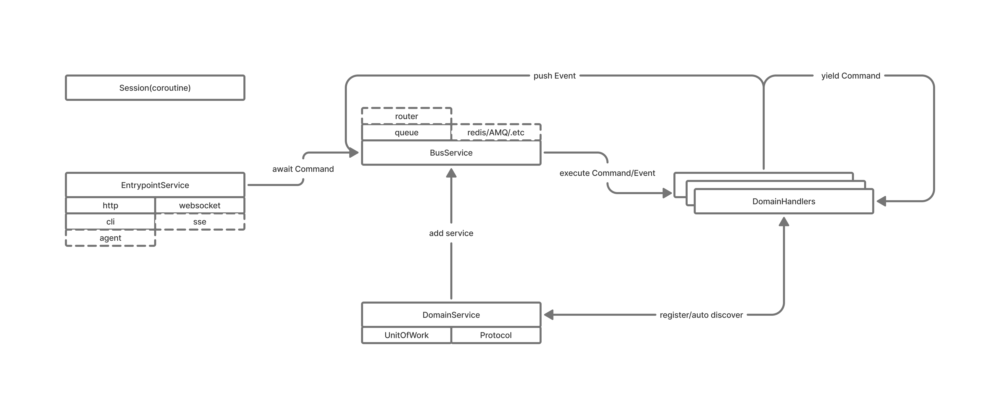

# Features

- Coroutines
- Event-driven, event specification via `models.base:BaseMessage`
- DDD and TDD as fundamental design paradigms
- Same logical flow, multiple entrypoints
- Global context session via `models.base:Session`
- Microservice orchestration via configuration file, enabling a more structured large-scale monolith; supports load balancing and system decomposition without code changes
- Asynchronous generator mechanism for organizing more complex atomic process calls
- Opentelemetry paradigm: logging, tracing, metrics
- Shell environment support
- Fast adaptation to legacy projects, non-intrusive iteration and development

# Core Concepts

`Command`, `Event`, `Handler`, `UnitOfWork`, `Service`, `Protocol`, `Session`

# CORE TODO LIST

- [ ] ftr: IOC agent can be injected as an entrypoint, behaves like an API and can invoke all handlers
- [ ] ftr: hot reloading
- [ ] ftr: state service
  - [ ] ftr: label support
  - [ ] ftr: rete
- [ ] ftr: distribute service
  - [ ] ftr: priority system
  - [ ] ftr: add alias routing in `router_mapping`
- [ ] ftr: telemetry service
  - [ ] ftr: opentelemetry
- [ ] ftr: pydantic plugin to validate reserved keywords in input parameters
- [ ] ftr: service builder to create AppService
- [X] ftr: on 0.1.3, `command` combine to one handler, `event` combine to multi or rewrite, opt autodiscover
- [X] ftr: `.wheel` install support & `uv` install
- [X] opt: rename `bus` to `hub`
- [ ] ftr: support handler message be waited in collection from other handlers message by ctx
- [ ] fix: SqlAlchemyAsyncUnitOfWork bug, pytest not pass


# MODULE TODO LIST

- [ ] opt: WebSocket middleware
- [ ] ftr: add toggle in entrypoint to enable or disable receiving specific messages(distribute service)
- [ ] ftr: HTTP messages debounce or QoS

# .env

global  
BOLLYDOG_COMMAND_EXPIRE_TIME  
BOLLYDOG_EVENT_EXPIRE_TIME  
BOLLYDOG_LOG_LEVEL  
BOLLYDOG_HANDLERS   

http api  
BOLLYDOG_HTTP_SERVICE_HOST  
BOLLYDOG_HTTP_SERVICE_DEBUG  
BOLLYDOG_HTTP_SERVICE_PORT  
BOLLYDOG_HTTP_SERVICE_LOG_LEVEL  
BOLLYDOG_HTTP_SERVICE_PRIVATE_KEY  
BOLLYDOG_HTTP_SERVICE_PUBLIC_KEY  

websocket  
BOLLYDOG_WS_SERVICE_HOST  
BOLLYDOG_WS_SERVICE_DEBUG  
BOLLYDOG_WS_SERVICE_PORT  
BOLLYDOG_WS_SERVICE_LOG_LEVEL  


# DESIGN

> [__Architecture Patterns with Python__](https://www.cosmicpython.com/book/preface.html) Designed as a foundational design paradigm.


> [__`mode` module__](https://github.com/faust-streaming/mode) Acts as a foundational application framework.

Defines the core execution logic.



# HOW

## pip

```shell
git clone https://github.com/3sy11/bollydog.git
pip install -e .
```

## uv 

```shell
git clone https://github.com/3sy11/bollydog.git
cd bollydog
uv sync
uv sync --dev
```

## build

```shell
uv build --all
uv run uv pip install dist/bollydog-*.whl
bollydog --help

```

# CLI

```shell
#execute a command  
cd bollydog/example
bollydog execute --config='./config.yaml' --message=example.handler.TaskCount
```

```shell
#start up service as config.yml  
bollydog service --config "./config.yaml"
curl http://0.0.0.0:8000/example/exampleservice/taskcount
```

```shell
# ptpython shell
bollydog shell --config "./config.yaml"
```

```python
locals()
from example.handler import TaskList,task_list
await task_list(TaskList())
```
